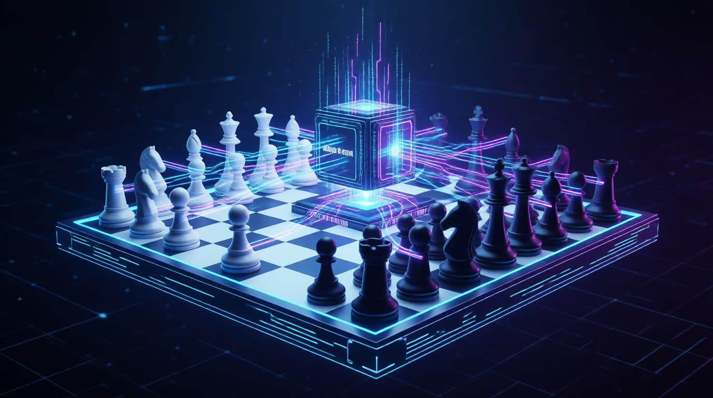

**Мы рады приветствовать вас на старте проекта Chess960v2.com!**

22 января 2026 года мы перевернули страницу шахматной теории и запустили беспрецедентный эксперимент — **1-й официальный чемпионат по расширенной версии шахмат Фишера**.

Если в классике мы веками изучаем одну позицию, а в обычных шахматах-960 — зеркальные расстановки, то мы пошли дальше. Что будет, если сильнейший кремниевый разум сыграет сам с собой во всех возможных незеркальных комбинациях?

### Грандиозный масштаб: 921 600 уникальных партий

Суть чемпионата проста и одновременно монументальна: легендарный движок **Stockfish (v15.1)** играет сам с собой. Но главное условие — полная переборка вариантов. Каждая из 960 возможных начальных позиций белых сыграет против каждой из 960 позиций чёрных.

*   **960 туров** в течение года.
*   **921 600** уникальных битв.
*   **Асимметрия:** Позиции соперников не обязаны быть зеркальными, что рождает совершенно новые стратегические рисунки боя.

### Техническая мощь

Чтобы реализовать этот марафон, мы используем мощное оборудование, работающее 24/7. Игра ведется одновременно на 12 досках с контролем времени 2 секунды на ход. Это позволяет нам проводить не менее 3-х туров (около 3000 матчей) ежедневно.

**Сердце нашего сервера:**
*   **CPU:** AMD Ryzen 9 7950X (16 ядер, 4.5 ГГц)
*   **RAM:** 64 ГБ DDR5
*   **SSD:** Высокоскоростной U.2 NVMe (800 МБ)

### Open Source: Код доступен каждому

Мы верим в открытость и поддержку сообщества. Проект Chess960v2 имеет полностью открытый исходный код. Это значит, что любой желающий может изучить алгоритмы работы, предложить улучшения или запустить подобный чемпионат на своём оборудовании с собственными параметрами.

📂 **Репозиторий на GitHub:** [https://github.com/lavren1974/Chess960v2](https://github.com/lavren1974/Chess960v2)

Присоединяйтесь к разработке, форкайте проект и создавайте собственные базы партий!

### Зачем это нужно игрокам?

Этот сайт — лаборатория для людей.
1.  **База знаний:** Изучайте, как идеальный компьютерный разум решает проблемы развития фигур в самых диких позициях.
2.  **Избранное:** Зарегистрированные пользователи могут сохранять интересные расстановки, чтобы внедрять новые приемы в свой арсенал — будь то для классики или Фишера.

### Взгляд в будущее: Разведка и «Туман войны»

То, что вы видите сейчас — лишь начало. Скоро мы запустим **онлайн-платформу для игры реальных людей**, которая привнесет в шахматы элемент военной стратегии.

В планах:
*   **Элемент разведки:** Вместо фигур соперника вы будете видеть обычные пешки. Вам придется проводить разведку, чтобы понять, где спрятан ферзь или слон врага.
*   **Битвы движков:** Платформа для программистов, где движки будут сражаться в условиях неполной информации, не зная расстановки соперника.
*   **Собственные расстановки:** Игроки сами смогут выбирать стартовую позицию своих фигур.

### Следите за ходом эксперимента

Промежуточные итоги, скриншоты лидеров каждые 10 туров, архивы партий и живое обсуждение стратегий — всё это в нашем Telegram-канале.

👉 **Присоединяйтесь:** [t.me/Chess960v2](https://t.me/Chess960v2)

Добро пожаловать в новую вселенную шахмат!
